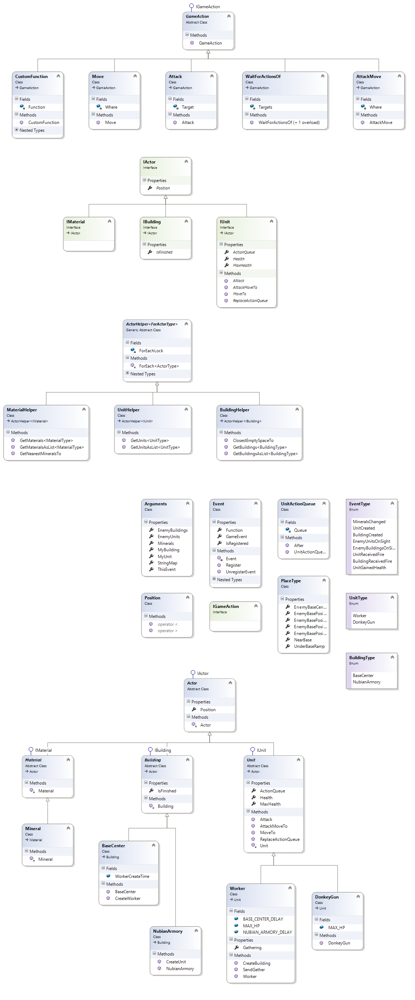

# Vitajte v pomocníkovi pre hru XposeCraft
Hra **[XposeCraft](https://github.com/scscgit/XposeCraft)** nie je obyčajná (zábavná) hra podobná hrám, ktoré sa ovládajú klávesnicou a myšou. Je to náučné prostredie určené na výučbu programovania v jazyku C#. Hru je potrebné hrať písaním zdrojového kódu robota, ktorý sa následne s hrou spojí a bude sa hrať samostatne. Ide o stratégiu, v ktorej je vašim cieľom zničiť všetky nepriateľské budovy skôr, než nepriateľ zničí tie vaše.

# Inštalácia prostredia
Pre programovanie odporúčam buď bezplatné vývojárske prostredie **[Visual Studio Community](https://www.visualstudio.com/cs/downloads/)** od Microsoftu, alebo jednu z vhodných (lepších) alternatív, ktorou je nástroj od firmy JetBrains, keďže ho majú študenti k dispozícii zadarmo - **[Rider](https://www.jetbrains.com/rider/)**. V čase písania bol v stave Early Build.

# Príprava prostredia
Je potrebné stiahnuť súbory z tohto GitHub projektu. Najrýchlejší spôsob je buď stlačiť tlačidlo na vrchu tejto stránky, alebo na stránke <https://github.com/scscgit/XposeCraft/> vpravo kliknúť na tlačidlo Clone or download a zvoliť voľbu Download ZIP, prípadne kliknúť **[sem](https://github.com/scscgit/XposeCraft/archive/master.zip)**. Druhou alternatívou je lokálne si projekt pomocou Gitu naklonovať. Následne vo vašom obľúbenom C# editore projekt spustíte, napríklad otvorením súboru s príponou .sln v koreňovom adresári projektu.

***

# Programátorské rozhranie hry (API)
Jazyk, v ktorom je napísaná samotná hra a ktorý sa používa aj na písanie robota sa volá **C#**. Existujú rôzne návody vo forme kníh alebo webstránok, príkladmi sú jedna **[anglická](https://www.tutorialspoint.com/csharp/csharp_basic_syntax.htm)** a jedna **[česká](http://programujte.com/clanky/34-serial-c/)** stránka, ktoré sa zaoberajú úplnými základmi. Platí ale, že väčšinou už prvé lekcie pracujú s funkciami z rámca .NET, akou je napríklad [`Console.WriteLine`](https://msdn.microsoft.com/en-us/library/system.console.writeline(v=vs.110).aspx). Počas programovania robota bude ale táto znalosť zbytočná, keďže sa neprogramuje aplikácia pre konzolu. Poskytujem ale podobnú funkcionalitu, ktorú je dobrovoľne možné využívať na písanie správ do výstupného logu zobrazovaného po spustení simulácie, napríklad cez `Log.i(object kontext, string sprava);`.

## Písanie testov a overovanie úspešnosti
Práca na vlastnom kóde robota prebieha výhradne v adresári (balíku) **[Test](https://github.com/scscgit/XposeCraft/tree/master/Assets/Scripts/Test)**, nachádzajúcom sa v adresári projektu. Obsahuje 3 triedy s fázami hry prebiehajúcimi v nasledujúcom poradí:
* Economy - získavanie surovín,
* Building - stavanie budov a jednotiek,
* Battle - bojovanie s nepriateľom.

Na voľbe umiestnenia kódu síce striktne nezáleží, ale dodržanie tejto štruktúry výrazne zlepší prehľadnosť kódu. Každá trieda obsahuje jednu hlavnú public void metódu, kde sa má nachádzať váš kód, a ktorá poskytuje cez vstupný parameter funkciu `startNextStage`, ktorej zavolanie ako `startNextStage();` spustí nasledujúcu fázu. Prvou fázou je teda EconomyStage. Okrem týchto tried je povolené ľubovoľné vytváranie ďalších tried. Príkladom je pripravená trieda `MyBot`.

Po akejkoľvek zmene je možnosť projekt spustiť a nechať zbehnúť testy, čím sa overí ako správnosť syntaxe, tak aj správne využitie funkcií.

## Diagram Tried dostupného rozhrania

[](ClassDiagramGame.png)

## Návod ku programátorskému rozhraniu hry (API)
Adresár (balíček) s poskytovaným API hry sa nazýva Game a na vyššie uvedenom obrázku sú znázornené všetky jeho časti. Táto sekcia obsahuje podrobný popis každej z nich, ale pozostáva iba z verejne viditeľných členov (public). Nadpis každej triedy obsahuje v zátvorke úplne jednoznačný názov, ktorý v prípade priloženia sekcie `using` nie je potrebné písať namiesto skráteného tvaru. Sekcia 'using' sa pre danú triedu vytvorí napríklad stlačením kombinácie kláves CTRL+BODKA vo Visual Studiu alebo ALT+ENTER pri používaní skratiek programu Rider nad názvom triedy v kóde a zvolením tejto voľby.

***

### <a name="event" />Trieda **Event** (XposeCraft.Game.Event)

Dátové členy:
* `bool IsRegistered { get; }`
* `EventType GameEvent { get; }`
* `FunctionWithArguments Function { get; }`

Delegáty:
* `delegate void FunctionWithArguments(Arguments args)`

Statické metódy:
* `static Event Register(EventType gameEvent, FunctionWithArguments function)`

Metódy:
* `void UnregisterEvent()`

Použitie:
* Na získanie inštancie registrovanej udalosti (Eventu) sa používa iba statická metóda Register. Táto udalosť zaregistruje v systéme udalostí, čo spôsobí, že pokiaľ v hre kedykoľvek nastane zvolená udalosť typu EventType, vykoná sa funkcia, ktorej vstupom budú argumenty súvisiace s aktuálnou udalosťou. Ak sa už vykonávanie funkcie v hre nevyžaduje, inštanciu registrovanej udalosti je potrebné odstránit zavolaním jej metódy UnregisterEvent(). Pred použitím udalosti sa pre viac detailov obráťťe na jej dokumentáciu.

Príklad:
```c#
var registeredEvent = Event.Register(EventType.EnemyUnitsOnSight, args => {
	foreach(Worker worker in UnitHelper.GetUnits<Worker>()) {
		worker.MoveTo(PlaceType.NearBase);
	}
});
// When the event is not needed anymore
event.UnregisterEvent();
```
***

### <a name="arguments" />Trieda **Arguments** (XposeCraft.Game.Arguments)

Dátové členy:
* `Event ThisEvent { get; set; }`
* `IDictionary<string, string> StringMap { get; }`
* `int Minerals { get; set; }`
* `public IUnit MyUnit { get; set; }`
* `public IBuilding MyBuilding { get; set; }`
* `public IUnit[] EnemyUnits { get; set; }`
* `public IBuilding[] EnemyBuildings { get; set; }`

Použitie:
* Každá funkcia registrovaná pre [Event](#event) je typu **Event.FunctionWithArguments**, takže sa jedná o inštanciu delegáta na funkciu, ktorá vracia void a jej vstup je typu Arguments. Tento vstup je poskytnutý danou udalosťou, ktorá v hre nastala a dostupnosť rôznych hodnôt je definovaná v dokumentácii triedy [EventType](#event-type). Ostatné hodnoty nemusia byť k dispozicii. Medzi špeciálne členy patrí **ThisEvent**, ktorý poskytuje inštanciu na aktuálny [Event](#event), ktorý túto funkciu spustil.

***

### <a name="event-type" />Enumeračný typ **EventType** (XposeCraft.Game.Enums)

Použitie:  
* Herná logika je riadená udalosťami, ktoré môžu nastať a ovplyvniť rozhodnutia súperov. Vždy, keď v hre nastane nová udalosť, vykonajú sa funkcie všetkých inštancií udalosti, ktoré sú k tomuto typu udalosti priradené. Funkcia zároveň dostane informácie o konkrétnej udalosti pomocou premennej typu Arguments. Každá udalosť má inú podmienku a poskytuje iné informácie.

Možnosti + ich dostupné argumenty pre Event:  
* MineralsChanged - Nastala zmena v počte minerálov, ktoré má hráč k dispozícii.
	* int Minerals - Aktuálny počet minerálov.
* UnitCreated - V budove bola vytvorená nová jednotka.
	* IBuilding MyBuilding - Budova, v ktorej bola vytvorená nová jednotka.
	* IUnit MyUnit - V rámci udalosti vytvorená jednotka.
* BuildingCreated - Úsilím pracovníka bola vytvorená nová budova.
	* IUnit MyUnit - Pracovník typu Worker, ktorý vytvoril budovu.
	* IBuilding MyBuilding- V rámci udalosti vytvorená budova.
* EnemyUnitsOnSight - Naše jednotky uvideli nepriateľské jednotky.
	* IUnit MyUnit - Jednotka, ktorá uvidela nepriateľa.
	* IUnit[] EnemyUnits - Jednotky nepriateľa, ktoré boli zbadané.
* EnemyBuildingsOnSight - Naše jednotky uvideli nepriateľské budovy.
	* IUnit MyUnit - Jednotka, ktorá uvidela nepriateľa.
	* IBuilding[] EnemyBuildings - Budovy nepriateľa, ktoré boli zbadané.
* UnitReceivedFire - Nepriateľ zaútočil na našu jednotku.
	* IUnit MyUnit - Jednotka, na ktorú zaútočil nepriateľ.
	* IUnit[] EnemyUnits - Jednotky nepriateľa, ktoré našej jednotke spôsobili zranenie.
* BuildingReceivedFire - Nepriateľ zaútočil na našu budovu.
	* IBuilding MyBuilding - Budova, na ktorú zaútočil nepriateľ.
	* IUnit[] EnemyUnits - Jednotky nepriateľa, ktoré našej budove spôsobili poškodenie.
* UnitGainedHealth - Jednotka bola úplne vyliečená buď po určitej dobe, alebo druhou jednotkou.
	* IUnit MyUnit - Jednotka, ktorá bola vyliečená.

Príklad:
```c#
Event.Register(EventType.EnemyUnitsOnSight, args => {
	foreach(IUnit unit in UnitHelper.GetUnits<DonkeyGun>()) {
		unit.Attack(args.EnemyUnits[0]);
	}
});
```

***

### <a name="unit-helper" />Trieda **UnitHelper** (XposeCraft.Game.Helpers.UnitHelper)

Statické metódy:
* `static IList<UnitType> GetUnitsAsList<UnitType>()  where UnitType : IUnit`
* `static UnitType[] GetUnits<UnitType>() where UnitType : IUnit`

Použitie:
* Trieda pomocníka poskytuje možnosť staticky získať ľubovoľné vlastnené jednotky, ktoré má hráč možnosť ovládať. Vrátené jednotky budú iba tie, ktoré spĺňajú typ UnitType, takže pre vrátenie všetkých je možné použiť typ IUnit. Návratový typ môže byť buď list alebo pole.

Príklad:
```c#
if(UnitHelper.GetUnits<Worker>().Length < 5) {
	foreach(Worker worker in UnitHelper.GetUnits<Worker>()) {
		worker.MoveTo(PlaceType.NearBase);
	}
}
```

***

# Úlohy
### Scenár č. 1: Nastavenie vývojárskeho prostredia pre programovanie robota.  
* S1.1. Nájdite a prečítajte si (tento) návod na hranie, obsahujúci diagram tried rozhrania.  
* S1.2. Podľa návodu si nainštalujte vývojárske prostredie.  
* S1.3. Stiahnite a otvorte si projekt hry vo vývojárskom prostredí, cez ktoré hru úspešne spustíte.  

### Scenár č. 2: Splnenie základných úloh v rámci ekonomickej fázy hry pre získanie dostatočného množstva surovín.  
* S2.1. Hru ste začali s jednou budovou BaseCenter a jedným pracovníkom Worker. Pošlite pracovníka zbierať suroviny.  
* S2.2. Čo najskôr ako to len bude možné, vytvorte štyroch ďalších pracovníkov (cena každého je 50 minerálov) a posielajte ich zbierať ďalšie suroviny.  

### Scenár č. 3: Vytvorenie budovy a vytváranie jednotiek použitím nazbieraných surovín.  
* S3.1. Počkajte, kým získate 150 minerálov a použite ich na konštrukciu prvej budovy typu NubianArmory (ktorej účel je vytváranie jednotiek) blízko vašej prvej BaseCenter.  
* S3.2. Čo najskôr vytvorte 5 bojovníkov s názvom DonkeyGun (cena každého je 50 minerálov).  

### Scenár č. 4: Zaútočenie na nepriateľa.  
* S4.1. Pošlite bojovníkov útočiť smerom k nepriateľovi a cestou útočte na nepriateľské jednotky.  
* S4.2. Vylepšite stratégiu aby vaše jednotky prežili čo najdlhšie a vyberali si iba vhodné momenty na útok.  

# Ukončenie testu
Po vykonaní všetkých požadovaných testov stačí odovzdať váš zdrojový kód osobne dopredu dohodnutým spôsobom - stačí napríklad zazipovať adresár Test, keďže očakávam, že všetky zmeny nastali iba tam.  

# Diskusia
[Vstup na disqus](disqus.html)
